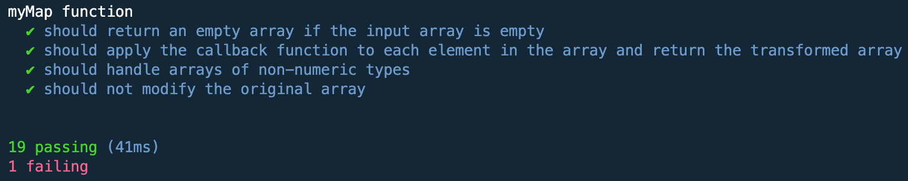

# Práctica 4

En esta actividad, la Práctica 4 de la asignatura, se nos plantean varios problemas de programación que nos ayudarán a conocer más en profundidad los arrays, tuplas y enumerados de TypeScript.
A continuación se mostrarán las soluciones para los problemas mencionados anteriormente, acompañados de explicaciones y comentarios que faciliten su comprendimiento.


## _Ejercicio 1 - El alergólogo_

### Enunciado:

Una prueba de alérgenos produce un valor numérico (entero positivo) único, el cual contiene información sobre las alergias de una persona. La lista de posibles alérgenos es la siguiente:

Huevo (1)
Cacahuete (2)
Marisco (4)
Fresa (8)
Tomate (16)
Chocolate (32)
Polen (64)
Gato (128)
Por ejemplo, si alguien fuera alérgico a los gatos y al tomate, obtendría una puntuación igual a 128 + 16 = 144.

Escriba una función getAllergens que reciba una puntuación de alérgenos de una persona y que devuelva una lista con los alérgenos a los que la persona es alérgica. Los diferentes alérgenos deberán modelarse mediante un enumerado.

Por último, tenga en cuenta que la función podría recibir una puntuación que incluya alérgenos no contemplados en la lista, esto es, alérgenos cuya puntuación sea 256, 512, 1024, etc. Además, si el valor pasado como argumento no es entero y positivo, la función deberá retornar el valor undefined.

#### Código

``` TypeScript

/**
 * This enumeration shows the different allergens that we have in this case.
 * @enum
 */

export enum Allergen {
    Huevo = 1,
    Cacahuete = 2,
    Marisco = 4,
    Fresa = 8,
    Tomate = 16,
    Chocolate = 32,
    Polen = 64,
    Gato = 128,
  }
  
/**
 * Function that returns to which allergens a person is allergic.
 * @param puntuation - Total puntuation of a person allergies.
 * @returns - List of allergens to which that person is allergic.
 */
  export function getAllergens(puntuation: number): Allergen[] | undefined {
    if (!Number.isInteger(puntuation) || puntuation <= 0) {
      return undefined;
    }
  
    const allergens = Object.values(Allergen).filter(
      (allergen) => typeof allergen === "number" && puntuation & allergen
    );
  
    return allergens as Allergen[];
  }

```

El código define una enumeración llamada ```Allergen``` que contiene diferentes tipos de alergias, cada uno representado por un número entero diferente. La función ```getAllergens``` toma como argumento una puntuación total de las alergias de una persona y devuelve una lista de las alergias a las que esa persona es alérgica, según la puntuación que le pasemos.

La función primero comprueba si la puntuación es un número entero válido y mayor que cero. Luego utiliza el método ```Object.values``` para extraer los valores numéricos de la enumeración ```Allergen```. Luego, filtra los valores numéricos para encontrar aquellos que están incluidos en la puntuación proporcionada usando el operador "&" (AND binario). Finalmente, devuelve la lista de alergenos a los que la persona es alérgica en forma de arreglo de la enumeración "Allergen".

#### Comprobaciones

Hemos hecho las siguientes comprobaciones con console.log():

``` TypeScript

console.log(getAllergens(129));
console.log(getAllergens(257));
console.log(getAllergens(256));
console.log(getAllergens(515));
console.log(getAllergens(84));

```

Cuyos resultados son:

```bash
[ 1, 128 ]
[ 1 ]
[]
[ 1, 2 ]
[ 4, 16, 64 ]
```

Y también se han realizado pruebas con Mocha y a Chai. A continuación veremos el fichero ```.spec.ts```que hemos creado para este ejercicio:

```TypeScript

import 'mocha';
import {expect} from 'chai';
import {getAllergens, Allergen} from '../src/ejercicio-1';

describe('getAllergens function tests', () => {
  it('should return the correct allergens for a given score', () => {
    const result = getAllergens(129);
    expect(result).to.include(Allergen.Huevo);
    expect(result).to.include(Allergen.Gato);
    expect(result).to.have.lengthOf(2);
  });

  it('should return an empty array if the score does not contain any allergens', () => {
    const result = getAllergens(256);
    expect(result).to.be.an('array').that.is.empty;
  });

  it('should return the correct allergens when the score contains multiple allergens', () => {
    const result = getAllergens(515);
    expect(result).to.include(Allergen.Huevo);
    expect(result).to.include(Allergen.Cacahuete);
    expect(result).to.have.lengthOf(2);
  });

  it('should handle scores that include allergens not in the enum', () => {
    const result = getAllergens(511);
    expect(result).to.include(Allergen.Huevo);
    expect(result).to.include(Allergen.Cacahuete);
    expect(result).to.include(Allergen.Marisco);
    expect(result).to.include(Allergen.Fresa);
    expect(result).to.include(Allergen.Tomate);
    expect(result).to.include(Allergen.Chocolate);
    expect(result).to.include(Allergen.Polen);
    expect(result).to.include(Allergen.Gato);
    expect(result).to.have.lengthOf(8);
  });

  it('should return undefined for not integer and not positive scores', () => {
    expect(getAllergens(-5)).to.be.undefined;
    expect(getAllergens(3.5)).to.be.undefined;
    expect(getAllergens(NaN)).to.be.undefined;
  });
});

```


## _Ejercicio 2 - Números complejos_

### Enunciado:

Con lo visto hasta ahora en la asignatura, defina un tipo de datos propio que permita representar un número complejo, esto es, pares de valores numéricos reales, donde la primera componente del par es la parte real del complejo, mientras que la segunda componente del par representa su parte imaginaria.

A continuación, partiendo de dicha definición, escriba funciones que permitan calcular las siguientes operaciones sobre números complejos:

Suma, resta, multiplicación y división (funciones add, sub, mult y div). Estas funciones reciben como argumentos dos complejos y devuelven un complejo.
Producto escalar (función prod). Esta función recibe como argumentos un complejo y un número real, retornando un número complejo.
Conjugado (función conj). Recibe como argumento un complejo y devuelve otro complejo.
Módulo (función abs). La función recibe como argumento un complejo y retorna un valor real.

#### Código

``` TypeScript

/**
 * Represent a complex number.
 */
type ComplexNumber = [number, number];

/**
 * Adding two complex numbers.
 * @param a First complex number.
 * @param b Second complex number.
 * @returns The result is a complex number too.
 */
function add(a: ComplexNumber, b: ComplexNumber): ComplexNumber {
  return [a[0] + b[0], a[1] + b[1]];
}

/**
 * Subtracting two complex numbers.
 * @param a First complex number.
 * @param b Second complex number.
 * @returns The result is a complex number too.
 */
function sub(a: ComplexNumber, b: ComplexNumber): ComplexNumber {
  return [a[0] - b[0], a[1] - b[1]];
}

/**
 * Multiplication of two complex numbers.
 * @param a First complex number.
 * @param b Second complex number.
 * @returns The result is a complex number too.
 */
function mult(a: ComplexNumber, b: ComplexNumber): ComplexNumber {
  const real = a[0] * b[0] - a[1] * b[1];
  const imaginary = a[0] * b[1] + a[1] * b[0];
  return [real, imaginary];
}

/**
 * Division of two complex numbers.
 * @param a First complex number.
 * @param b Second complex number.
 * @returns The result is a complex number too.
 */
function div(a: ComplexNumber, b: ComplexNumber): ComplexNumber {
  const real = (a[0] * b[0] + a[1] * b[1]) / (b[0] * b[0] + b[1] * b[1]);
  const imaginary = (a[1] * b[0] - a[0] * b[1]) / (b[0] * b[0] + b[1] * b[1]);
  return [real, imaginary];
}

/**
 * Scalar product of a complex number and a real number.
 * @param a The complex number to scale.
 * @param b The real number by which the complex number is scaled.
 * @returns The result of the dot product as a complex number.
 */
function prod(a: ComplexNumber, b: number): ComplexNumber {
  return [a[0] * b, a[1] * b];
}

/**
 * Conjugate of a complex number.
 * @param a The complex number to calculate its conjugate.
 * @returns The conjugate of the complex number as a complex number.
 */
function conj(a: ComplexNumber): ComplexNumber {
  return [a[0], -a[1]];
}

/**
 * Module of a complex number.
 * @param a The complex number to calculate its module.
 * @returns The module of the complex number as a real number.
 */
function abs(a: ComplexNumber): number {
  return Math.sqrt(a[0] * a[0] + a[1] * a[1]);
}


const a1: ComplexNumber = [3, 4];
const a2: ComplexNumber = [1, -2];

```

En este caso son definidas varias funciones para trabajar con números complejos, que se representan como una tupla de dos números. La tupla representa la parte real e imaginaria del número complejo, respectivamente.

Las funciones definidas son: ```add```= sumar, ```sub```= restar, ```mult```= multiplicar, ```div```= dividir,  ```prod```= producto escalar, ```conj```= conjugado y ```abs```= calcular el módulo de un complejo. Cada función toma dos argumentos que son números complejos y devuelve un número complejo que representa el resultado de la operación correspondiente.

Además, se definen dos constantes ```a1``` y ```a2``` que son números complejos que se utilizan para probar las diferentes funciones.


#### Comprobaciones

Hemos hecho las siguientes comprobaciones con console.log():

``` TypeScript

console.log("Suma: ", add(a1, a2));
console.log("Resta: ", sub(a1, a2));
console.log("Multiplicación: ", mult(a1, a2));
console.log("División: ", div(a1, a2));
console.log("Producto escalar: ", prod(a1, 2));
console.log("Conjugado de a1: ", conj(a1));
console.log("Módulo de a1: ", abs(a1));

```

Cuyos resultados son:

```bash

Suma:  [ 4, 2 ]
Resta:  [ 2, 6 ]
Multiplicación:  [ 11, -2 ]
División:  [ -1, 2 ]
Producto escalar:  [ 6, 8 ]
Conjugado de a1:  [ 3, -4 ]
Módulo de a1:  5

```

Y también se han realizado pruebas con Mocha y a Chai. A continuación veremos el fichero ```.spec.ts```que hemos creado para este ejercicio:

```TypeScript


```


## _Ejercicio 3 - No cabrees a la reina_

### Enunciado:

Dadas las posiciones de dos reinas en un tablero de ajedrez, determine si ambas reinas podrían atacarse en caso de cabrearse una con la otra. En el ajedrez, una reina puede atacar piezas ubicadas en la misma fila, columna o diagonal.

Un tablero de ajedrez puede representarse mediante un array bidimensional de 8 x 8 casillas. Por lo tanto, si la reina negra está ubicada en la posición (1, 3), mientras que la reina blanca está ubicada en la posición (3, 5), tendríamos una estructura de datos como la que sigue:

[

    [-, -, -, -, -, -, -, -]
    
    [-, -, -, N, -, -, -, -]
    
    [-, -, -, -, -, -, -, -]
    
    [-, -, -, -, -, B, -, -]
    
    [-, -, -, -, -, -, -, -]
    
    [-, -, -, -, -, -, -, -]
    
    [-, -, -, -, -, -, -, -]
    
    [-, -, -, -, -, -, -, -]
    
]

Escriba una función checkAtack que, dada una estructura de datos como la anterior, devuelva un valor lógico indicando si ambas reinas podrían atacarse dadas las posiciones de las mismas. Tenga en cuenta que solo puede haber una reina blanca y una reina negra en el tablero. En caso de que lo anterior no suceda, la función deberá devolver el valor undefined.

Por último, el tablero debe consistir en, exactamente, 8 filas y 8 columnas, donde cada casilla puede contener alguno de los valores -, N o B, exclusivamente. Aunque la anterior comprobación podría llevarse a cabo a través del código fuente incluido en la función (en tiempo de ejecución), defina un tipo de datos adecuado que impida, desde el punto de vista del tipado (en tiempo de compilación), pasarle a la función checkAtack un tablero no válido, esto es, con un número de filas/columnas diferente a 8 y/o celdas con valores no válidos).

#### Código

``` TypeScript

/**
 * Defines which are the possible types for the cells of the chess.
 */
type ChessCell = "-" | "N" | "B";

/**
 * Defines the data type for the chess.
 */
type ChessBoard = [ChessCell[], ChessCell[], ChessCell[], ChessCell[], ChessCell[], ChessCell[], ChessCell[], ChessCell[]];

/**
 * Determines if two queens can attack each other on the chess.
 * @param board The chess board.
 * @returns True if both of the queens can attack each other, false if not. Undefined if the chess board is not valid because of the size or any irregularity.
 */
function checkAtack(board: ChessBoard): boolean | undefined {
  if (board.length !== 8 || board.some(row => row.length !== 8 || row.some(cell => !["-", "N", "B"].includes(cell)))) {
    return undefined;
  }

  let blackQueen: [number, number] | undefined = undefined;
  let whiteQueen: [number, number] | undefined = undefined;

  for (let i = 0; i < 8; i++) {
    for (let j = 0; j < 8; j++) {
      if (board[i][j] === "N") {
        blackQueen = [i, j];
      } else if (board[i][j] === "B") {
        whiteQueen = [i, j];
      }
    }
  }

  if (blackQueen === undefined || whiteQueen === undefined) {
    return undefined;
  }

  return blackQueen[0] === whiteQueen[0] || blackQueen[1] === whiteQueen[1] || Math.abs(blackQueen[0] - whiteQueen[0]) === Math.abs(blackQueen[1] - whiteQueen[1]);
}

```

Lo primero de nuestro programa es que definimos el tipo ```ChessCell```,que viene siendo que tipo de valores nos podemos encontrar en las casillas del tablero de ajedrez, en este caso se nos ha pedido que los valores sean: "-", "N", o "B". También definimos el tipo ```ChessBoard```, que es básicamente una matriz 8x8 que representa nuestro tablero de ajedrez.

La función ```checkAtack``` determina si dos reinas pueden atacarse mutuamente en el tablero de ajedrez proporcionado, que solo pueden cuando se encuentran en línea recta o en diagonal. La función recibe un argumento board de tipo ```ChessBoard``` y devuelve un valor booleano o ```undefined```. Si el tablero no tiene el tamaño correcto que es el de 8x8, o contiene elementos que no son de tipo ```ChessCell``` ya mencionado, la función devuelve ```undefined```. Si no se encuentran dos reinas en el tablero, la función también devuelve ```undefined```.

La función utiliza dos variables ```blackQueen``` y ```whiteQueen``` para comprobar la posición de las dos reinas. Luego, se realiza una comprobación para ver si las reinas se encuentran en la misma fila, columna o diagonal, y en ese caso, la función devuelve true, lo que indica que ambas reinas pueden atacarse mutuamente. Si no, la función devuelve false, lo que indica que las reinas no se pueden atacar mutuamente.

#### Comprobaciones

Hemos hecho las siguientes comprobaciones con console.log():

``` TypeScript

const board1: ChessBoard = [
    ["-", "-", "-", "-", "-", "-", "-", "-"],
    ["-", "-", "-", "N", "-", "-", "-", "-"],
    ["-", "-", "-", "-", "-", "-", "-", "-"],
    ["-", "-", "-", "-", "-", "B", "-", "-"],
    ["-", "-", "-", "-", "-", "-", "-", "-"],
    ["-", "-", "-", "-", "-", "-", "-", "-"],
    ["-", "-", "-", "-", "-", "-", "-", "-"],
    ["-", "-", "-", "-", "-", "-", "-", "-"],
  ];
console.log("¿Las reinas pueden atacarse en el tablero 1?", checkAtack(board1)); // true porque están en diagonal

  const board2: ChessBoard = [
    ["-", "-", "-", "-", "-", "-", "-", "-"],
    ["-", "-", "-", "-", "-", "-", "-", "-"],
    ["-", "-", "-", "-", "-", "-", "-", "-"],
    ["-", "-", "-", "-", "-", "-", "-", "-"],
    ["-", "-", "-", "-", "-", "-", "-", "-"],
    ["-", "-", "-", "-", "-", "-", "-", "-"],
    ["-", "-", "-", "N", "-", "-", "-", "B"],
    ["-", "-", "-", "-", "-", "-", "-", "-"],
  ];
console.log("¿Las reinas pueden atacarse en el tablero 2?", checkAtack(board2)); // true porque estan en línea horizontal

  const board3: ChessBoard = [
    ["-", "-", "-", "-", "-", "-", "-", "-"],
    ["-", "-", "-", "-", "-", "-", "-", "-"],
    ["-", "-", "-", "-", "-", "-", "-", "-"],
    ["-", "-", "-", "N", "-", "-", "-", "-"],
    ["-", "-", "-", "-", "-", "-", "-", "-"],
    ["-", "-", "-", "-", "-", "-", "-", "-"],
    ["-", "-", "-", "-", "-", "-", "-", "B"],
    ["-", "-", "-", "-", "-", "-", "-", "-"],
  ];
console.log("¿Las reinas pueden atacarse en el tablero 3?", checkAtack(board3)); // false no hay manera directa de atacarse

  const board4: ChessBoard = [
    ["-", "-", "-", "-", "-", "-", "-", "-", "-"],
    ["-", "-", "-", "-", "-", "-", "-", "-", "-"],
    ["-", "-", "-", "-", "-", "-", "-", "-", "-"],
    ["-", "-", "-", "N", "-", "-", "-", "-", "-"],
    ["-", "-", "-", "-", "-", "-", "-", "-", "-"],
    ["-", "-", "-", "-", "-", "-", "-", "-", "-"],
    ["-", "-", "-", "B", "-", "-", "-", "-", "-"],
    ["-", "-", "-", "-", "-", "-", "-", "-", "-"],
  ];
console.log("¿Las reinas pueden atacarse en el tablero 4?", checkAtack(board4)); // undefined porque el tablero es más grande de lo permitido

```

Cuyos resultados son:

```bash

¿Las reinas pueden atacarse en el tablero 1? true
¿Las reinas pueden atacarse en el tablero 2? true
¿Las reinas pueden atacarse en el tablero 3? false
¿Las reinas pueden atacarse en el tablero 4? undefined

```

Y también se han realizado pruebas con Mocha y a Chai. A continuación veremos el fichero ```.spec.ts```que hemos creado para este ejercicio:

```TypeScript

import 'mocha';
import {expect} from 'chai';
import { ChessCell, ChessBoard, checkAtack } from '../src/ejercicio-3';

describe('chessboard operations', () => {
    it('should return true if two queens can attack each other horizontally', () => {
      const board: ChessBoard = [      ["-", "-", "-", "-", "-", "-", "-", "-"],
        ["-", "-", "-", "-", "-", "-", "-", "-"],
        ["-", "-", "-", "-", "-", "-", "-", "-"],
        ["-", "-", "-", "-", "N", "-", "-", "-"],
        ["-", "-", "-", "-", "-", "-", "-", "-"],
        ["-", "-", "-", "-", "-", "-", "-", "-"],
        ["-", "-", "-", "-", "B", "-", "-", "-"],
        ["-", "-", "-", "-", "-", "-", "-", "-"]
      ];
      const result = checkAtack(board);
      expect(result).to.be.true;
    });
  
    it('should return true if two queens can attack each other vertically', () => {
      const board: ChessBoard = [      ["-", "-", "-", "-", "-", "-", "-", "-"],
        ["-", "-", "-", "-", "-", "-", "-", "-"],
        ["-", "-", "-", "-", "B", "-", "-", "-"],
        ["-", "-", "-", "-", "-", "-", "-", "-"],
        ["-", "-", "-", "-", "-", "-", "-", "-"],
        ["-", "-", "-", "-", "N", "-", "-", "-"],
        ["-", "-", "-", "-", "-", "-", "-", "-"],
        ["-", "-", "-", "-", "-", "-", "-", "-"]
      ];
      const result = checkAtack(board);
      expect(result).to.be.true;
    });
  
    it('should return true if two queens can attack each other diagonally', () => {
      const board: ChessBoard = [      ["-", "-", "-", "-", "-", "-", "-", "-"],
        ["-", "-", "-", "-", "-", "-", "-", "-"],
        ["-", "-", "-", "-", "-", "-", "-", "-"],
        ["-", "-", "-", "N", "-", "-", "-", "-"],
        ["-", "-", "-", "-", "-", "-", "-", "-"],
        ["-", "-", "-", "-", "-", "-", "-", "-"],
        ["-", "-", "-", "-", "-", "-", "B", "-"],
        ["-", "-", "-", "-", "-", "-", "-", "-"]
      ];
      const result = checkAtack(board);
      expect(result).to.be.true;
    });
  
    it('should return false if two queens cannot attack each other', () => {
      const board: ChessBoard = [      ["-", "-", "-", "-", "-", "-", "-", "-"],
        ["-", "-", "-", "-", "-", "-", "-", "-"],
        ["-", "-", "-", "-", "-", "-", "-", "-"],
        ["-", "-", "-", "N", "-", "-", "-", "-"],
        ["-", "-", "-", "-", "-", "-", "-", "-"],
        ["-", "-", "-", "-", "-", "-", "-", "-"],
        ["-", "-", "-", "-", "-", "-", "-", "B"],
        ["-", "-", "-", "-", "-", "-", "-", "-"]
      ];
      const result = checkAtack(board);
      expect(result).to.be.false;
    });
  });

```


## _Ejercicio 4 - Reimplementando la función ```map```_

### Enunciado:

Implemente una función que emule el comportamiento de la función map proporcionada por el lenguaje sin hacer uso esta última. La función map actúa sobre una colección de elementos, modificando el valor de cada uno de ellos en base a un callback que se le pasa como argumento.

Teniendo en cuenta lo anterior, escriba una función myMap que reciba una colección (array) de valores numéricos como primer argumento, además de un callback que permita modificar cada elemento de la colección como segundo argumento. La función deberá devolver la colección modificada.

#### Código

``` TypeScript

/**
 * Function that receives an element from the collection and returns its modified version.
 * @param elemento The element of the collection to modify.
 * @returns The modified item.
 */
type MapCallback<T> = (elemento: T) => T;

/**
 * Modifies each element of a collection based on a callback.
 * @param collection The collection of elements to modify.
 * @param callback The callback that defines the modification to apply to each element.
 * @returns The modified collection.
 */
function myMap<T>(collection: T[], callback: MapCallback<T>): T[] {
  const result: T[] = [];

  for (let i = 0; i < collection.length; i++) {
    result.push(callback(collection[i]));
  }

  return result;
}

```

Definimos la función ```myMap``` que recibe una colección de elementos y una función de devolución de llamada que define una transformación para aplicarsela a los elementos de la colección.

La función ```myMap utiliza``` el tipo genérico T para indicar el tipo de elemento que se encuentra en la colección. También define un tipo de devolución de llamada ```MapCallback<T>``` que indica que la función de devolución de llamada toma un parámetro elemento de tipo T y devuelve un valor del mismo tipo.

La función de ```myMap``` utiliza un bucle for para iterar sobre la colección y aplicar la función de devolución de llamada a cada elemento. Cada elemento se pasa a la función de devolución de llamada, que devuelve su versión modificada. La función de ```myMap``` almacena cada elemento modificado en un nuevo cambio ```result``` y devuelve ese cambio al final.

#### Comprobaciones

Hemos hecho las siguientes comprobaciones con console.log():

``` TypeScript

const collection_1 = [0, 1, 2, 3, 4];
const modCollection_1 = myMap(collection_1, (elemento) => elemento * elemento);
console.log(modCollection_1);

const collection_2 = ["e", "d", "u", "a", "r"];
const modCollection_2 = myMap(collection_2, (elemento) => `elemento ${elemento}`);
console.log(modCollection_2);

```

Cuyos resultados son:

```bash

[ 0, 1, 4, 9, 16 ]
[
  'elemento e',
  'elemento d',
  'elemento u',
  'elemento a',
  'elemento r'
]

```

Y también se han realizado pruebas con Mocha y a Chai. A continuación veremos el fichero ```.spec.ts```que hemos creado para este ejercicio:

```TypeScript

import 'mocha';
import {expect} from 'chai';
import { myMap } from '../src/ejercicio-4';

describe('myMap function', () => {
  it('should return an empty array if the input array is empty', () => {
    const input: number[] = [];
    const result = myMap(input, x => x * 2);
    expect(result).to.deep.equal([]);
  });

  it('should apply the callback function to each element in the array and return the transformed array', () => {
    const input = [1, 2, 3];
    const result = myMap(input, x => x * 2);
    expect(result).to.deep.equal([2, 4, 6]);
  });

  it('should handle arrays of non-numeric types', () => {
    const input = ['hello', 'world'];
    const result = myMap(input, x => x.toUpperCase());
    expect(result).to.deep.equal(['HELLO', 'WORLD']);
  });

  it('should not modify the original array', () => {
    const input = [1, 2, 3];
    myMap(input, x => x * 2);
    expect(input).to.deep.equal([1, 2, 3]);
  });
});


```



## _Ejercicio 5 - Matrices espirales_

### Enunciado:

Escriba una función getSpiralMatrix que, dado un entero positivo n representando el tamaño de una matriz cuadrada, devuelva una matriz (array bidimensional) con todos los números enteros en el rango [1, n*n] y que estén dispuestos en la matriz conformando una espiral. La espiral debe comenzar en la primera fila y columna de la matriz e irse completando siguiendo las agujas del reloj.

#### Código

``` TypeScript

/**
 * Generates a square matrix with integers arranged in a spiral.
 * @param n The size of the square matrix.
 * @returns The array with the integers arranged in a spiral.
 */
function getSpiralMatrix(n: number): number[][] {
    const matrix: number[][] = [];
  
    for (let i = 0; i < n; i++) {
      matrix.push(new Array(n));
    }
  
    let top = 0, bottom = n - 1, left = 0, right = n - 1;
    let value = 1;
  
    while (top <= bottom && left <= right) {
      for (let i = left; i <= right; i++) {
        matrix[top][i] = value++;
      }
      top++;
  
      for (let i = top; i <= bottom; i++) {
        matrix[i][right] = value++;
      }
      right--;
  
      if (top <= bottom) {
        for (let i = right; i >= left; i--) {
          matrix[bottom][i] = value++;
        }
        bottom--;
      }
  
      if (left <= right) {
        for (let i = bottom; i >= top; i--) {
          matrix[i][left] = value++;
        }
        left++;
      }
    }
    return matrix;
}

```

En este caso hemos tenido que definit la función ```getSpiralMatrix```, que genera una matriz cuadrada con enteros que forman una espiral, recorriendo de fuera a dentro la matriz ordenando los valores que muestra de menor a mayor.

La función toma un parámetro ```n```, que es el tamaño de la matriz cuadrada que se va a generar. La función comienza creando una matriz cuadrada vacía utilizando dos bucles ```for``` anidados que recorren cada fila y columna de la matriz.

La función luego utiliza cuatro variables, ```top```, ```bottom```, ```left``` y ```right```, para ir siguiendo la posición actual de la espiral a medida que se construye la matriz. Estas variables que acabo de mencionar comienzan en 0 y se incrementan y disminuyen a medida que la espiral se desarrolla/va avanzando.

La función utiliza otros cuatro bucles ```for``` anidados para agregar valores a la matriz en forma de espiral:

- El primer bucle agrega valores a la fila superior de la matriz, de izquierda a derecha. 

- El segundo bucle agrega valores a la columna derecha de la matriz, de arriba a abajo. 

- El tercer bucle agrega valores a la fila inferior de la matriz, de derecha a izquierda. 

- El cuarto bucle agrega valores a la columna izquierda de la matriz, de abajo hacia arriba.

#### Comprobaciones

Hemos hecho las siguientes comprobaciones con console.log():

``` TypeScript

console.log(getSpiralMatrix(3));
console.log(getSpiralMatrix(4));
console.log(getSpiralMatrix(5));
console.log(getSpiralMatrix(6));

```

Cuyos resultados son:

```bash

[ 
  [ 1, 2, 3 ], 

  [ 8, 9, 4 ], 

  [ 7, 6, 5 ] 
  
]

[
  [ 1, 2, 3, 4 ],

  [ 12, 13, 14, 5 ],

  [ 11, 16, 15, 6 ],

  [ 10, 9, 8, 7 ]

]

[

  [ 1, 2, 3, 4, 5 ],

  [ 16, 17, 18, 19, 6 ],

  [ 15, 24, 25, 20, 7 ],

  [ 14, 23, 22, 21, 8 ],

  [ 13, 12, 11, 10, 9 ]

]

[

  [ 1, 2, 3, 4, 5, 6 ],

  [ 20, 21, 22, 23, 24, 7 ],

  [ 19, 32, 33, 34, 25, 8 ],

  [ 18, 31, 36, 35, 26, 9 ],

  [ 17, 30, 29, 28, 27, 10 ],

  [ 16, 15, 14, 13, 12, 11 ]

]

```

Y también se han realizado pruebas con Mocha y a Chai. A continuación veremos el fichero ```.spec.ts```que hemos creado para este ejercicio:

```TypeScript

import 'mocha';
import {expect} from 'chai';
import { getSpiralMatrix } from '../src/ejercicio-5';

describe('getSpiralMatrix function', () => {
  it('should return an empty array if the input is 0', () => {
    const result = getSpiralMatrix(0);
    expect(result).to.deep.equal([]);
  });

  it('should return a 1x1 array if the input is 1', () => {
    const result = getSpiralMatrix(1);
    expect(result).to.deep.equal([[1]]);
  });

  it('should generate a 2x2 matrix with values in a spiral', () => {
    const result = getSpiralMatrix(2);
    expect(result).to.deep.equal([[1, 2], [4, 3]]);
  });

  it('should generate a 3x3 matrix with values in a spiral', () => {
    const result = getSpiralMatrix(3);
    expect(result).to.deep.equal([[1, 2, 3], [8, 9, 4], [7, 6, 5]]);
  });

  it('should generate a 5x5 matrix with values in a spiral', () => {
    const result = getSpiralMatrix(5);
    expect(result).to.deep.equal([
      [1, 2, 3, 4, 5],
      [16, 17, 18, 19, 6],
      [15, 24, 25, 20, 7],
      [14, 23, 22, 21, 8],
      [13, 12, 11, 10, 9],
    ]);
  });
});

```


## _Ejercicio 6 - Compresión de números en rangos_

### Enunciado:

Escriba una función fromArrayToRanges que reciba un array o lista de números enteros y los comprima en rangos, es decir, que devuelva una cadena de caracteres con la compresión obtenida. Un rango, es decir, un conjunto de números consecutivos se representará mediante una cadena de caracteres con el primer y último número del rango separado por un guión bajo (_). Un rango de un único número será la cadena de caracteres que representa a ese ùnico número. Luego, una serie de rangos vendrá separada por comas (,).
Ejemplos:

[5, 6, 7, 9, 12, 13, 14] => “5_7, 9, 12_14”

[-3, -2, -1, 3, 5, 6, 7] => “-3_-1, 3, 5_7”

[17] => “17”

[3, 5, 6, 7, 9, 10] => “3, 5_7, 9_10”


Escriba una función fromRangesToArray que lleve a cabo la operación inversa, es decir, que reciba como argumento una cadena de caracteres representando una serie de rangos y devuelva el array de números correspondiente.

#### Código

``` TypeScript

/**
 * Compresses an array of numbers into ranges.
 * @param arrai The array of numbers to compress.
 * @returns The character string representing the returned ranges.
 */
function fromArrayToRanges(arrai: number[]): string {
    if (arrai.length === 0) {
      return "";
    }
  
    const ranges: string[] = [];
    let start = arrai[0];
    let end = arrai[0];
  
    for (let i = 1; i < arrai.length; i++) {
      if (arrai[i] === end + 1) {
        end = arrai[i];
      } else {
        ranges.push(start === end ? `${start}` : `${start}_${end}`);
        start = arrai[i];
        end = arrai[i];
      }
    }
  
    ranges.push(start === end ? `${start}` : `${start}_${end}`);
  
    return ranges.join(", ");
  }
  
  /**
   * Decompresses a string of characters into an array of numbers.
   * @param str The character string representing the ranges.
   * @returns The array of numbers corresponding to the ranges.
   */
  function fromRangesToArray(str: string): number[] {
    const ranges = str.split(", ");
    const result: number[] = [];
  
    for (let i = 0; i < ranges.length; i++) {
      const range = ranges[i].split("_");
  
      if (range.length === 1) {
        result.push(parseInt(range[0]));
      } else {
        const start = parseInt(range[0]);
        const end = parseInt(range[1]);
        for (let j = start; j <= end; j++) {
          result.push(j);
        }
      }
    }
  
    return result;
}

```

Tenemos dos funciones, ```fromArrayToRanges``` y ```fromRangesToArray```, que se utilizan para convertir entre una cadena de caracteres que representa un rango de números y un arreglo de números digamos.

La función ```fromArrayToRanges``` toma un arreglo de números y devuelve una cadena de caracteres que representa los rangos en el arreglo. La función itera sobre el arreglo y determina los rangos de números que aparecen consecutivamente. Luego, para cada rango, la función agrega una cadena de caracteres que representa ese rango al arreglo ```ranges```. Finalmente, la función une todos los elementos del arreglo ```ranges``` con una coma ```,``` y un espacio ``` ``` para producir la cadena de caracteres de salida.

La función ```fromRangesToArray```hace lo contrario a la anterior,  toma una cadena de caracteres que representa un rango de números y devuelve el arreglo que corresponde a los números en el rango. En esta función utilizamos la función ```split``` para dividir la cadena de caracteres de entrada en rangos individuales. Luego, para cada rango, la función divide la cadena de caracteres del rango en dos números, el inicio y el final del rango. La función itera desde el inicio hasta el final del rango y agrega cada número al arreglo ```result```. Finalmente, devuelve ```result```ahora si con todos los números correspondientes al rango.

#### Comprobaciones

Hemos hecho las siguientes comprobaciones con console.log():

``` TypeScript

console.log(fromArrayToRanges([5, 6, 7, 9, 12, 13, 14]));
console.log(fromArrayToRanges([-3, -2, -1, 3, 5, 6, 7]));
console.log(fromArrayToRanges([17]));
console.log(fromArrayToRanges([3, 5, 6, 7, 9, 10]));
  
console.log(fromRangesToArray("5_7, 9, 12_14"));
console.log(fromRangesToArray("-3_-1, 3, 5_7"));
console.log(fromRangesToArray("17"));
console.log(fromRangesToArray("3, 5_7, 9_10"));

```

Cuyos resultados son:

```bash

5_7, 9, 12_14

-3_-1, 3, 5_7

17

3, 5_7, 9_10

[
   5,  6,  7, 9, 12, 13, 14
]

[
  -3, -2, -1, 3, 5,  6,  7
]

[ 17 ]

[ 3, 5, 6, 7, 9, 10 ]

```

Y también se han realizado pruebas con Mocha y a Chai. A continuación veremos el fichero ```.spec.ts```que hemos creado para este ejercicio:

```TypeScript

import 'mocha';
import {expect} from 'chai';
import { fromArrayToRanges, fromRangesToArray } from '../src/ejercicio-6';

describe('fromArrayToRanges function', () => {
  it('should return an empty string if the input array is empty', () => {
    const input: number[] = [];
    const result = fromArrayToRanges(input);
    expect(result).to.equal("");
  });

  it('should return a string that represents the ranges in the input array', () => {
    const input = [1, 2, 3, 5, 6, 7, 10];
    const result = fromArrayToRanges(input);
    expect(result).to.equal("1_3, 5_7, 10");
  });
});

describe('fromRangesToArray function', () => {
  it('should return an empty array if the input string is empty', () => {
    const input = "";
    const result = fromRangesToArray(input);
    expect(result).to.deep.equal([]);
  });

  it('should return an array of numbers that corresponds to the input string', () => {
    const input = "1_3, 5_7, 10";
    const result = fromRangesToArray(input);
    expect(result).to.deep.equal([1, 2, 3, 5, 6, 7, 10]);
  });
});

```


## _Ejercicio 7 - Decodificar resistencias_

### Enunciado:

Si desea realizar algún proyecto usando una Raspberry Pi, probablemente necesitará usar resistencias. Para este ejercicio necesita conocer dos cosas sobre las resistencias:

Cada resistor o resistencia tiene un valor de resistencia en Ohmios asociado. Además, las resistencias son tan pequeñas que si se les imprimiera el valor en ellas, sería muy difícil de leer. Para resolver este problema, los fabricantes siguen un estándar de bandas codificadas de colores para indicar sus valores de resistencia. Cada banda tiene una posición y un valor numérico.

Las primeras dos bandas de una resistencia tienen un esquema de codificación muy simple: cada color se mapea a un único número. Por ejemplo, si una resistencia tiene impresa una banda marrón (valor 1) seguida de una banda verde (valor 5), el valor de la resistencia se traduciría al número 15.

El objetivo de este ejercicio es crear un programa que nos ayude a calcular el valor de una resistencia sin tener que memorizar los valores de las bandas. Para ello, cree una función decodeResistor que recibe como parámetros los nombres de los colores de una resistencia como entrada y devuelve un número de dos dígitos indicando el valor de la resistencia. La función deberá devover un número de dos dígitos incluso si recibe más de dos colores como parámetros.

Las bandas de colores están codificadas de la siguiente manera:

Negro: 0
Marrón: 1
Rojo: 2
Naranja: 3
Amarillo: 4
Verde: 5
Azul: 6
Violeta: 7
Gris: 8
Blanco: 9
De este modo, la combinación Marrón-Verde debería devolver 15 al igual que Marrón-Verde-Violeta ignorando el tercer color.

#### Código

``` TypeScript

/**
 * Decodes the value of a resistor based on the colors of its bands.
 * @param colors The colors of the resistance bands.
 * @returns The numerical value of the resistor.
 */
function decodeResistor(colors: string[]): number {
    const equivalence = {
      negro: 0,
      marrón: 1,
      rojo: 2,
      naranja: 3,
      amarillo: 4,
      verde: 5,
      azul: 6,
      violeta: 7,
      gris: 8,
      blanco: 9,
    };
  
    const color1 = equivalence[colors[0].toLowerCase()];
    const color2 = equivalence[colors[1].toLowerCase()];
    const result = (color1 * 10) + color2;
  
    return result;
}

```

Programa con una sencilla función llamada ```decodeResistor``` a la que le damos unos colores, que en este caso representan las bandas de resistencia y nos devuelve su valor numérico.

La función utiliza ```equivalence``` que nos da la correspondencia entre el color y su valor numérico. Para cada color de la entrada, la función utiliza ```equivalence``` para determinar su valor numérico y lo almacena en ```color1``` y ```color2```. Luego, la función calcula el valor de la resistencia sumando el valor de la primera banda multiplicado por diez y el valor de la segunda banda y nos devuelve ese valor ya sumado.

#### Comprobaciones

Hemos hecho las siguientes comprobaciones con console.log():

``` TypeScript

console.log(decodeResistor(["Marrón", "Verde"]));
console.log(decodeResistor(["Marrón", "Verde", "Violeta"]));
console.log(decodeResistor(["Amarillo", "Blanco"]));
console.log(decodeResistor(["Negro", "Negro"]));
console.log(decodeResistor(["Naranja", "Azul", "Verde", "Blanco"]));

```

Cuyos resultados son:

```bash
15
15
49
0
36
```

Y también se han realizado pruebas con Mocha y a Chai. A continuación veremos el fichero ```.spec.ts```que hemos creado para este ejercicio:

```TypeScript

import 'mocha';
import {expect} from 'chai';
import {decodeResistor} from '../src/ejercicio-7';

describe('decodeResistor function', () => {
  it('should return the correct value for a two-band resistor', () => {
    const result = decodeResistor(['marrón', 'negro']);
    expect(result).to.equal(1);
  });

  it('should return the correct value for a three-band resistor', () => {
    const result = decodeResistor(['marrón', 'negro', 'rojo']);
    expect(result).to.equal(10);
  });

  it('should return the correct value for a four-band resistor', () => {
    const result = decodeResistor(['marrón', 'negro', 'negro', 'rojo']);
    expect(result).to.equal(100);
  });

  it('should return the correct value for a five-band resistor', () => {
    const result = decodeResistor(['marrón', 'negro', 'negro', 'oro', 'marrón']);
    expect(result).to.equal(1000);
  });

  it('should return the correct value for a six-band resistor', () => {
    const result = decodeResistor(['marrón', 'negro', 'negro', 'marrón', 'negro', 'plata']);
    expect(result).to.equal(100000);
  });
});

```


## _Ejercicio 8 - Palabras encadenadas en un array_

### Enunciado:

Dado un array que contiene exclusivamente cadenas de texto, comprobar que las palabras del array están encadenadas. Esto es, una o más letras del final de una cadena coinciden con el comienzo de la siguiente cadena del array.

Ejemplos de palabras encadenadas:

“apply” and “plywood”

“apple” and “each”

“behemoth” and “mother”

Ejemplos de palabras no encadenadas:

“apply” and “playground”

“apple” and “peggy”

“behemoth” and “mathematics

Para resolver este ejercicio, escriba una función meshArray que compruebe si las cadenas del array están encadenadas o no. La función recibirá como parámetro un array de cadenas de texto y devolverá:

“Error al encadenar” si las cadenas del array no están encadenadas.
Una cadena de texto que contenga las letras que encadenan las palabras del array. A priori no sabe cuantas letras encadenadas tendrán en común, pero al menos será una.
Ejemplos de ejecución del programa:

1: [“allow”, “lowering”, “ringmaster”, “terror”] –> “lowringter”

Este array está encadenado porque:

Las letras “low” de la primera palabra encadenan con la palabra “lowering”.
Las letras “ring” en la segunda y tercera palabras están encadenadas.
Por último, las letras “ter” en las dos últimas palabras también están encadenadas.
2: [“kingdom”, “dominator”, “notorious”, “usual”, “allegory”] –> “Error al encadenar”

En este caso, aunque las palabras “dominator” y “notorious” comparten letras en el mismo orden, las últimas letras de la primera palabra no encadenan con las primeras letras de la segunda.

#### Código

``` TypeScript

/**
 * Check if the words in an array are chained.
 * @param words - An array of text strings.
 * @returns A text string containing the letters that string the words in the array, or "Error al encadenar" if the words are not connected.
 */
function meshArray(words: string[]): string {
  let result = "";
  for (let i = 0; i < words.length - 1; i++) {
    const current = words[i];
    const next = words[i + 1];
    let commonLetters = "";
    for (let j = 0; j < current.length; j++) {
      if (next.startsWith(current.slice(j))) {
        commonLetters = current.slice(j);
        break;
      }
    }
    if (commonLetters.length === 0) {
      return "Error al encadenar";
    }
    result += commonLetters;
  }
  return result;
}

```

En este último ejercicio tenemos la función llamada ```meshArray``` que comprueba si las palabras en un array están encadenadas y devuelve una cadena de texto que contiene las letras que encadenan las palabras en el array o un mensaje de error si no están conectadas de ninguna manera.

1. La función utiliza un bucle ```for``` para iterar por el array de palabras y compara cada palabra con la siguiente. 

2. La función utiliza un segundo bucle ```for``` que recorre cada letra de la palabra actual y busca una coincidencia en la siguiente palabra utilizando el método ```startsWith```. 

3. Si se encuentra una coincidencia, la función va almacenando las letras comunes en una variable de texto llamada ```commonLetters```.

4. Si no se encuentra ninguna coincidencia, la función devuelve un mensaje de error. Si se encuentran letras en común, la función las añade a una variable de texto ```result```.

5. Finalmente, la función devuelve la variable ```result`` que contiene las letras comunes que unen las palabras en el array, o un mensaje de error si las palabras no están conectadas.


#### Comprobaciones

Hemos hecho las siguientes comprobaciones con console.log():

``` TypeScript

console.log(meshArray(["eduardo", "oluis", "srodriguez", "zsan", "nblas"]));
console.log(meshArray(["allow", "lowering", "ringmaster", "terror"]));
console.log(meshArray(["kingdom", "dominator", "notorious", "usual", "allegory"]));
console.log(meshArray(["apply", "plywood"]));
console.log(meshArray(["apple", "each"]));
console.log(meshArray(["behemoth", "mother"]));
console.log(meshArray(["apply", "playground"]));
console.log(meshArray(["apple", "peggy"]));
console.log(meshArray(["behemoth", "mathematics"]));

```

Cuyos resultados son:

```bash

oszn
lowringter
Error al encadenar
ply
e
moth
Error al encadenar
Error al encadenar
Error al encadenar

```

Y también se han realizado pruebas con Mocha y a Chai. A continuación veremos el fichero ```.spec.ts```que hemos creado para este ejercicio:

```TypeScript
import 'mocha';
import { expect } from 'chai';
import { meshArray } from '../src/ejercicio-8';

describe('meshArray function', () => {
  it('should return an empty string when an empty array is passed', () => {
    const input: string[] = [];
    const result = meshArray(input);
    expect(result).to.equal('');
  });

  it('should return the common letters when the words are chained together', () => {
    const input = ['beach', 'achieve', 'evening'];
    const result = meshArray(input);
    expect(result).to.equal('che');
  });

  it('should return an error message when the words are not chained together', () => {
    const input = ['one', 'two', 'three'];
    const result = meshArray(input);
    expect(result).to.equal('Error al encadenar');
  });

  it('should handle an array with one word', () => {
    const input = ['hello'];
    const result = meshArray(input);
    expect(result).to.equal('');
  });

  it('should handle an array with two identical words', () => {
    const input = ['hello', 'hello'];
    const result = meshArray(input);
    expect(result).to.equal('hello');
  });
});
```


## Elementos Bibliográficos:

- Guión de la Práctica 4, https://ull-esit-inf-dsi-2223.github.io/prct04-arrays-tuples-enums/ .

- Guia de TypeDoc, https://typedoc.org/guides/installation/ .

- Comentarios en TypeDoc, https://typedoc.org/guides/doccomments/ .

- Guía sobre Mocha, https://mochajs.org/#getting-started .

- Guía sobre Chai, https://www.chaijs.com/guide/ .

- Vídeo de ejemplo de instalación y configuración de TypeDoc en un proyecto TypeScript, https://drive.google.com/file/d/19LLLCuWg7u0TjjKz9q8ZhOXgbrKtPUme/view .

- Vídeo de ejemplo de instalación y configuración de Mocha y Chai en un proyecto TypeScript, https://drive.google.com/file/d/1-z1oNOZP70WBDyhaaUijjHvFtqd6eAmJ/view .

- Sobre un warning en particular, https://github.com/TypeStrong/typedoc/issues/1966 .

- Adam Freeman - Essential TypeScript 4: From Beginner to ProURL,https://www.oreilly.com/library/view/essential-typescript-4/9781484270110/html/Part_1.xhtml .

- Basic writing and formatting syntax, https://docs.github.com/en/get-started/writing-on-github/getting-started-with-writing-and-formatting-on-github/basic-writing-and-formatting-syntax .


## Conclusiones

Ejercicios bastante entretenidos para probar cosas al igual que en la práctica 3, sobretodo sirven para  ir aprendiendo y conociendo nuevos métodos de los tipos de datos. En este caso gracias a estos ejercicios hemos aprendido y mejorado en cuanto a conocer más en profundidad los arrays, tuplas y enumerados. 

También hay que destacar que hemos aprendido nociones básicas de TypeDoc para poder generar documentación muy útil de una manera muy sencilla realmente. Por otra parte podríamos decir que lo más complejo esta vez ha sido empezar a hacer tests con Mocha y la librería Chai, pero es cuestión de ir probando cosas, que a base de errores también se aprende.
