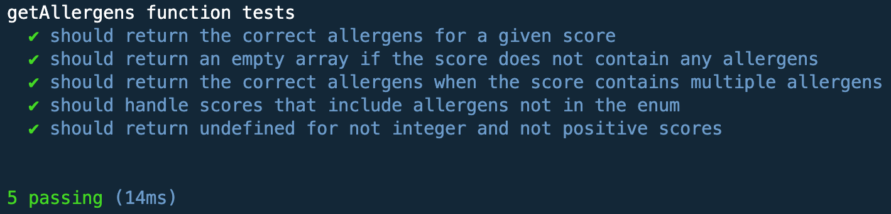
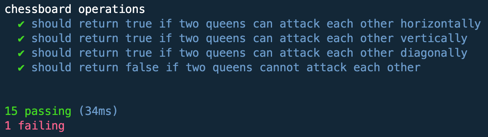

# Práctica 4

En esta actividad, la Práctica 4 de la asignatura, se nos plantean varios problemas de programación que nos ayudarán a conocer más en profundidad los arrays, tuplas y enumerados de TypeScript.
A continuación se mostrarán las soluciones para los problemas mencionados anteriormente, acompañados de explicaciones y comentarios que faciliten su comprendimiento.


## _Ejercicio 1 - El alergólogo_

### Enunciado:

Una prueba de alérgenos produce un valor numérico (entero positivo) único, el cual contiene información sobre las alergias de una persona. La lista de posibles alérgenos es la siguiente:

Huevo (1)
Cacahuete (2)
Marisco (4)
Fresa (8)
Tomate (16)
Chocolate (32)
Polen (64)
Gato (128)
Por ejemplo, si alguien fuera alérgico a los gatos y al tomate, obtendría una puntuación igual a 128 + 16 = 144.

Escriba una función getAllergens que reciba una puntuación de alérgenos de una persona y que devuelva una lista con los alérgenos a los que la persona es alérgica. Los diferentes alérgenos deberán modelarse mediante un enumerado.

Por último, tenga en cuenta que la función podría recibir una puntuación que incluya alérgenos no contemplados en la lista, esto es, alérgenos cuya puntuación sea 256, 512, 1024, etc. Además, si el valor pasado como argumento no es entero y positivo, la función deberá retornar el valor undefined.

#### Código

``` TypeScript

/**
 * This enumeration shows the different allergens that we have in this case.
 * @enum
 */

export enum Allergen {
    Huevo = 1,
    Cacahuete = 2,
    Marisco = 4,
    Fresa = 8,
    Tomate = 16,
    Chocolate = 32,
    Polen = 64,
    Gato = 128,
  }
  
/**
 * Function that returns to which allergens a person is allergic.
 * @param puntuation - Total puntuation of a person allergies.
 * @returns - List of allergens to which that person is allergic.
 */
  export function getAllergens(puntuation: number): Allergen[] | undefined {
    if (!Number.isInteger(puntuation) || puntuation <= 0) {
      return undefined;
    }
  
    const allergens = Object.values(Allergen).filter(
      (allergen) => typeof allergen === "number" && puntuation & allergen
    );
  
    return allergens as Allergen[];
  }

```

El código define una enumeración llamada ```Allergen``` que contiene diferentes tipos de alergias, cada uno representado por un número entero diferente. La función ```getAllergens``` toma como argumento una puntuación total de las alergias de una persona y devuelve una lista de las alergias a las que esa persona es alérgica, según la puntuación que le pasemos.

La función primero comprueba si la puntuación es un número entero válido y mayor que cero. Luego utiliza el método ```Object.values``` para extraer los valores numéricos de la enumeración ```Allergen```. Luego, filtra los valores numéricos para encontrar aquellos que están incluidos en la puntuación proporcionada usando el operador "&" (AND binario). Finalmente, devuelve la lista de alergenos a los que la persona es alérgica en forma de arreglo de la enumeración "Allergen".

#### Comprobaciones

Hemos hecho las siguientes comprobaciones con console.log():

``` TypeScript

console.log(getAllergens(129));
console.log(getAllergens(257));
console.log(getAllergens(256));
console.log(getAllergens(515));
console.log(getAllergens(84));

```

Cuyos resultados son:

```bash
[ 1, 128 ]
[ 1 ]
[]
[ 1, 2 ]
[ 4, 16, 64 ]
```

Y también se han realizado pruebas con Mocha y a Chai. A continuación veremos el fichero ```.spec.ts```que hemos creado para este ejercicio:

```TypeScript

import 'mocha';
import {expect} from 'chai';
import {getAllergens, Allergen} from '../src/ejercicio-1';

describe('getAllergens function tests', () => {
  it('should return the correct allergens for a given score', () => {
    const result = getAllergens(129);
    expect(result).to.include(Allergen.Huevo);
    expect(result).to.include(Allergen.Gato);
    expect(result).to.have.lengthOf(2);
  });

  it('should return an empty array if the score does not contain any allergens', () => {
    const result = getAllergens(256);
    expect(result).to.be.an('array').that.is.empty;
  });

  it('should return the correct allergens when the score contains multiple allergens', () => {
    const result = getAllergens(515);
    expect(result).to.include(Allergen.Huevo);
    expect(result).to.include(Allergen.Cacahuete);
    expect(result).to.have.lengthOf(2);
  });

  it('should handle scores that include allergens not in the enum', () => {
    const result = getAllergens(511);
    expect(result).to.include(Allergen.Huevo);
    expect(result).to.include(Allergen.Cacahuete);
    expect(result).to.include(Allergen.Marisco);
    expect(result).to.include(Allergen.Fresa);
    expect(result).to.include(Allergen.Tomate);
    expect(result).to.include(Allergen.Chocolate);
    expect(result).to.include(Allergen.Polen);
    expect(result).to.include(Allergen.Gato);
    expect(result).to.have.lengthOf(8);
  });

  it('should return undefined for not integer and not positive scores', () => {
    expect(getAllergens(-5)).to.be.undefined;
    expect(getAllergens(3.5)).to.be.undefined;
    expect(getAllergens(NaN)).to.be.undefined;
  });
});

```




## _Ejercicio 2 - Números complejos_

### Enunciado:

Con lo visto hasta ahora en la asignatura, defina un tipo de datos propio que permita representar un número complejo, esto es, pares de valores numéricos reales, donde la primera componente del par es la parte real del complejo, mientras que la segunda componente del par representa su parte imaginaria.

A continuación, partiendo de dicha definición, escriba funciones que permitan calcular las siguientes operaciones sobre números complejos:

Suma, resta, multiplicación y división (funciones add, sub, mult y div). Estas funciones reciben como argumentos dos complejos y devuelven un complejo.
Producto escalar (función prod). Esta función recibe como argumentos un complejo y un número real, retornando un número complejo.
Conjugado (función conj). Recibe como argumento un complejo y devuelve otro complejo.
Módulo (función abs). La función recibe como argumento un complejo y retorna un valor real.

#### Código

``` TypeScript

/**
 * Represent a complex number.
 */
type ComplexNumber = [number, number];

/**
 * Adding two complex numbers.
 * @param a First complex number.
 * @param b Second complex number.
 * @returns The result is a complex number too.
 */
function add(a: ComplexNumber, b: ComplexNumber): ComplexNumber {
  return [a[0] + b[0], a[1] + b[1]];
}

/**
 * Subtracting two complex numbers.
 * @param a First complex number.
 * @param b Second complex number.
 * @returns The result is a complex number too.
 */
function sub(a: ComplexNumber, b: ComplexNumber): ComplexNumber {
  return [a[0] - b[0], a[1] - b[1]];
}

/**
 * Multiplication of two complex numbers.
 * @param a First complex number.
 * @param b Second complex number.
 * @returns The result is a complex number too.
 */
function mult(a: ComplexNumber, b: ComplexNumber): ComplexNumber {
  const real = a[0] * b[0] - a[1] * b[1];
  const imaginary = a[0] * b[1] + a[1] * b[0];
  return [real, imaginary];
}

/**
 * Division of two complex numbers.
 * @param a First complex number.
 * @param b Second complex number.
 * @returns The result is a complex number too.
 */
function div(a: ComplexNumber, b: ComplexNumber): ComplexNumber {
  const real = (a[0] * b[0] + a[1] * b[1]) / (b[0] * b[0] + b[1] * b[1]);
  const imaginary = (a[1] * b[0] - a[0] * b[1]) / (b[0] * b[0] + b[1] * b[1]);
  return [real, imaginary];
}

/**
 * Scalar product of a complex number and a real number.
 * @param a The complex number to scale.
 * @param b The real number by which the complex number is scaled.
 * @returns The result of the dot product as a complex number.
 */
function prod(a: ComplexNumber, b: number): ComplexNumber {
  return [a[0] * b, a[1] * b];
}

/**
 * Conjugate of a complex number.
 * @param a The complex number to calculate its conjugate.
 * @returns The conjugate of the complex number as a complex number.
 */
function conj(a: ComplexNumber): ComplexNumber {
  return [a[0], -a[1]];
}

/**
 * Module of a complex number.
 * @param a The complex number to calculate its module.
 * @returns The module of the complex number as a real number.
 */
function abs(a: ComplexNumber): number {
  return Math.sqrt(a[0] * a[0] + a[1] * a[1]);
}


const a1: ComplexNumber = [3, 4];
const a2: ComplexNumber = [1, -2];

```

En este caso son definidas varias funciones para trabajar con números complejos, que se representan como una tupla de dos números. La tupla representa la parte real e imaginaria del número complejo, respectivamente.

Las funciones definidas son: ``àdd```= sumar, ```sub```= restar, ```mult```= multiplicar, ```div```= dividir,  ```prod```= producto escalar, ```conj```= conjugado y ``àbs```= calcular el módulo de un complejo. Cada función toma dos argumentos que son números complejos y devuelve un número complejo que representa el resultado de la operación correspondiente.

Además, se definen dos constantes ```a1``` y ```a2``` que son números complejos que se utilizan para probar las diferentes funciones.


#### Comprobaciones

Hemos hecho las siguientes comprobaciones con console.log():

``` TypeScript

console.log("Suma: ", add(a1, a2));
console.log("Resta: ", sub(a1, a2));
console.log("Multiplicación: ", mult(a1, a2));
console.log("División: ", div(a1, a2));
console.log("Producto escalar: ", prod(a1, 2));
console.log("Conjugado de a1: ", conj(a1));
console.log("Módulo de a1: ", abs(a1));

```

Cuyos resultados son:

```bash

Suma:  [ 4, 2 ]
Resta:  [ 2, 6 ]
Multiplicación:  [ 11, -2 ]
División:  [ -1, 2 ]
Producto escalar:  [ 6, 8 ]
Conjugado de a1:  [ 3, -4 ]
Módulo de a1:  5

```

Y también se han realizado pruebas con Mocha y a Chai. A continuación veremos el fichero ```.spec.ts```que hemos creado para este ejercicio:

```TypeScript


```


## _Ejercicio 3 - No cabrees a la reina_

### Enunciado:

Dadas las posiciones de dos reinas en un tablero de ajedrez, determine si ambas reinas podrían atacarse en caso de cabrearse una con la otra. En el ajedrez, una reina puede atacar piezas ubicadas en la misma fila, columna o diagonal.

Un tablero de ajedrez puede representarse mediante un array bidimensional de 8 x 8 casillas. Por lo tanto, si la reina negra está ubicada en la posición (1, 3), mientras que la reina blanca está ubicada en la posición (3, 5), tendríamos una estructura de datos como la que sigue:

[

    [-, -, -, -, -, -, -, -]
    
    [-, -, -, N, -, -, -, -]
    
    [-, -, -, -, -, -, -, -]
    
    [-, -, -, -, -, B, -, -]
    
    [-, -, -, -, -, -, -, -]
    
    [-, -, -, -, -, -, -, -]
    
    [-, -, -, -, -, -, -, -]
    
    [-, -, -, -, -, -, -, -]
    
]

Escriba una función checkAtack que, dada una estructura de datos como la anterior, devuelva un valor lógico indicando si ambas reinas podrían atacarse dadas las posiciones de las mismas. Tenga en cuenta que solo puede haber una reina blanca y una reina negra en el tablero. En caso de que lo anterior no suceda, la función deberá devolver el valor undefined.

Por último, el tablero debe consistir en, exactamente, 8 filas y 8 columnas, donde cada casilla puede contener alguno de los valores -, N o B, exclusivamente. Aunque la anterior comprobación podría llevarse a cabo a través del código fuente incluido en la función (en tiempo de ejecución), defina un tipo de datos adecuado que impida, desde el punto de vista del tipado (en tiempo de compilación), pasarle a la función checkAtack un tablero no válido, esto es, con un número de filas/columnas diferente a 8 y/o celdas con valores no válidos).

#### Código

``` TypeScript

/**
 * Defines which are the possible types for the cells of the chess.
 */
type ChessCell = "-" | "N" | "B";

/**
 * Defines the data type for the chess.
 */
type ChessBoard = [ChessCell[], ChessCell[], ChessCell[], ChessCell[], ChessCell[], ChessCell[], ChessCell[], ChessCell[]];

/**
 * Determines if two queens can attack each other on the chess.
 * @param board The chess board.
 * @returns True if both of the queens can attack each other, false if not. Undefined if the chess board is not valid because of the size or any irregularity.
 */
function checkAtack(board: ChessBoard): boolean | undefined {
  if (board.length !== 8 || board.some(row => row.length !== 8 || row.some(cell => !["-", "N", "B"].includes(cell)))) {
    return undefined;
  }

  let blackQueen: [number, number] | undefined = undefined;
  let whiteQueen: [number, number] | undefined = undefined;

  for (let i = 0; i < 8; i++) {
    for (let j = 0; j < 8; j++) {
      if (board[i][j] === "N") {
        blackQueen = [i, j];
      } else if (board[i][j] === "B") {
        whiteQueen = [i, j];
      }
    }
  }

  if (blackQueen === undefined || whiteQueen === undefined) {
    return undefined;
  }

  return blackQueen[0] === whiteQueen[0] || blackQueen[1] === whiteQueen[1] || Math.abs(blackQueen[0] - whiteQueen[0]) === Math.abs(blackQueen[1] - whiteQueen[1]);
}

```

Lo primero de nuestro programa es que definimos el tipo ```ChessCell```,que viene siendo que tipo de valores nos podemos encontrar en las casillas del tablero de ajedrez, en este caso se nos ha pedido que los valores sean: "-", "N", o "B". También definimos el tipo ```ChessBoard```, que es básicamente una matriz 8x8 que representa nuestro tablero de ajedrez.

La función ```checkAtack``` determina si dos reinas pueden atacarse mutuamente en el tablero de ajedrez proporcionado, que solo pueden cuando se encuentran en línea recta o en diagonal. La función recibe un argumento board de tipo ```ChessBoard``` y devuelve un valor booleano o ```undefined```. Si el tablero no tiene el tamaño correcto que es el de 8x8, o contiene elementos que no son de tipo ```ChessCell``` ya mencionado, la función devuelve ```undefined```. Si no se encuentran dos reinas en el tablero, la función también devuelve ```undefined```.

La función utiliza dos variables ```blackQueen``` y ```whiteQueen``` para comprobar la posición de las dos reinas. Luego, se realiza una comprobación para ver si las reinas se encuentran en la misma fila, columna o diagonal, y en ese caso, la función devuelve true, lo que indica que ambas reinas pueden atacarse mutuamente. Si no, la función devuelve false, lo que indica que las reinas no se pueden atacar mutuamente.

#### Comprobaciones

Hemos hecho las siguientes comprobaciones con console.log():

``` TypeScript

const board1: ChessBoard = [
    ["-", "-", "-", "-", "-", "-", "-", "-"],
    ["-", "-", "-", "N", "-", "-", "-", "-"],
    ["-", "-", "-", "-", "-", "-", "-", "-"],
    ["-", "-", "-", "-", "-", "B", "-", "-"],
    ["-", "-", "-", "-", "-", "-", "-", "-"],
    ["-", "-", "-", "-", "-", "-", "-", "-"],
    ["-", "-", "-", "-", "-", "-", "-", "-"],
    ["-", "-", "-", "-", "-", "-", "-", "-"],
  ];
console.log("¿Las reinas pueden atacarse en el tablero 1?", checkAtack(board1)); // true porque están en diagonal

  const board2: ChessBoard = [
    ["-", "-", "-", "-", "-", "-", "-", "-"],
    ["-", "-", "-", "-", "-", "-", "-", "-"],
    ["-", "-", "-", "-", "-", "-", "-", "-"],
    ["-", "-", "-", "-", "-", "-", "-", "-"],
    ["-", "-", "-", "-", "-", "-", "-", "-"],
    ["-", "-", "-", "-", "-", "-", "-", "-"],
    ["-", "-", "-", "N", "-", "-", "-", "B"],
    ["-", "-", "-", "-", "-", "-", "-", "-"],
  ];
console.log("¿Las reinas pueden atacarse en el tablero 2?", checkAtack(board2)); // true porque estan en línea horizontal

  const board3: ChessBoard = [
    ["-", "-", "-", "-", "-", "-", "-", "-"],
    ["-", "-", "-", "-", "-", "-", "-", "-"],
    ["-", "-", "-", "-", "-", "-", "-", "-"],
    ["-", "-", "-", "N", "-", "-", "-", "-"],
    ["-", "-", "-", "-", "-", "-", "-", "-"],
    ["-", "-", "-", "-", "-", "-", "-", "-"],
    ["-", "-", "-", "-", "-", "-", "-", "B"],
    ["-", "-", "-", "-", "-", "-", "-", "-"],
  ];
console.log("¿Las reinas pueden atacarse en el tablero 3?", checkAtack(board3)); // false no hay manera directa de atacarse

  const board4: ChessBoard = [
    ["-", "-", "-", "-", "-", "-", "-", "-", "-"],
    ["-", "-", "-", "-", "-", "-", "-", "-", "-"],
    ["-", "-", "-", "-", "-", "-", "-", "-", "-"],
    ["-", "-", "-", "N", "-", "-", "-", "-", "-"],
    ["-", "-", "-", "-", "-", "-", "-", "-", "-"],
    ["-", "-", "-", "-", "-", "-", "-", "-", "-"],
    ["-", "-", "-", "B", "-", "-", "-", "-", "-"],
    ["-", "-", "-", "-", "-", "-", "-", "-", "-"],
  ];
console.log("¿Las reinas pueden atacarse en el tablero 4?", checkAtack(board4)); // undefined porque el tablero es más grande de lo permitido

```

Cuyos resultados son:

```bash

¿Las reinas pueden atacarse en el tablero 1? true
¿Las reinas pueden atacarse en el tablero 2? true
¿Las reinas pueden atacarse en el tablero 3? false
¿Las reinas pueden atacarse en el tablero 4? undefined

```

Y también se han realizado pruebas con Mocha y a Chai. A continuación veremos el fichero ```.spec.ts```que hemos creado para este ejercicio:

```TypeScript

import 'mocha';
import {expect} from 'chai';
import { ChessCell, ChessBoard, checkAtack } from '../src/ejercicio-3';

describe('chessboard operations', () => {
    it('should return true if two queens can attack each other horizontally', () => {
      const board: ChessBoard = [      ["-", "-", "-", "-", "-", "-", "-", "-"],
        ["-", "-", "-", "-", "-", "-", "-", "-"],
        ["-", "-", "-", "-", "-", "-", "-", "-"],
        ["-", "-", "-", "-", "N", "-", "-", "-"],
        ["-", "-", "-", "-", "-", "-", "-", "-"],
        ["-", "-", "-", "-", "-", "-", "-", "-"],
        ["-", "-", "-", "-", "B", "-", "-", "-"],
        ["-", "-", "-", "-", "-", "-", "-", "-"]
      ];
      const result = checkAtack(board);
      expect(result).to.be.true;
    });
  
    it('should return true if two queens can attack each other vertically', () => {
      const board: ChessBoard = [      ["-", "-", "-", "-", "-", "-", "-", "-"],
        ["-", "-", "-", "-", "-", "-", "-", "-"],
        ["-", "-", "-", "-", "B", "-", "-", "-"],
        ["-", "-", "-", "-", "-", "-", "-", "-"],
        ["-", "-", "-", "-", "-", "-", "-", "-"],
        ["-", "-", "-", "-", "N", "-", "-", "-"],
        ["-", "-", "-", "-", "-", "-", "-", "-"],
        ["-", "-", "-", "-", "-", "-", "-", "-"]
      ];
      const result = checkAtack(board);
      expect(result).to.be.true;
    });
  
    it('should return true if two queens can attack each other diagonally', () => {
      const board: ChessBoard = [      ["-", "-", "-", "-", "-", "-", "-", "-"],
        ["-", "-", "-", "-", "-", "-", "-", "-"],
        ["-", "-", "-", "-", "-", "-", "-", "-"],
        ["-", "-", "-", "N", "-", "-", "-", "-"],
        ["-", "-", "-", "-", "-", "-", "-", "-"],
        ["-", "-", "-", "-", "-", "-", "-", "-"],
        ["-", "-", "-", "-", "-", "-", "B", "-"],
        ["-", "-", "-", "-", "-", "-", "-", "-"]
      ];
      const result = checkAtack(board);
      expect(result).to.be.true;
    });
  
    it('should return false if two queens cannot attack each other', () => {
      const board: ChessBoard = [      ["-", "-", "-", "-", "-", "-", "-", "-"],
        ["-", "-", "-", "-", "-", "-", "-", "-"],
        ["-", "-", "-", "-", "-", "-", "-", "-"],
        ["-", "-", "-", "N", "-", "-", "-", "-"],
        ["-", "-", "-", "-", "-", "-", "-", "-"],
        ["-", "-", "-", "-", "-", "-", "-", "-"],
        ["-", "-", "-", "-", "-", "-", "-", "B"],
        ["-", "-", "-", "-", "-", "-", "-", "-"]
      ];
      const result = checkAtack(board);
      expect(result).to.be.false;
    });
  });

```




## _Ejercicio 4 - Reimplementando la función ```map```_

### Enunciado:

Implemente una función que emule el comportamiento de la función map proporcionada por el lenguaje sin hacer uso esta última. La función map actúa sobre una colección de elementos, modificando el valor de cada uno de ellos en base a un callback que se le pasa como argumento.

Teniendo en cuenta lo anterior, escriba una función myMap que reciba una colección (array) de valores numéricos como primer argumento, además de un callback que permita modificar cada elemento de la colección como segundo argumento. La función deberá devolver la colección modificada.

#### Código

``` TypeScript
```

#### Comprobaciones

Hemos hecho las siguientes comprobaciones con console.log():

``` TypeScript
```

Cuyos resultados son:

```bash

```

Y también se han realizado pruebas con Mocha y a Chai. A continuación veremos el fichero ```.spec.ts```que hemos creado para este ejercicio:

```TypeScript


```


## _Ejercicio 5 - Matrices espirales_

### Enunciado:

Escriba una función getSpiralMatrix que, dado un entero positivo n representando el tamaño de una matriz cuadrada, devuelva una matriz (array bidimensional) con todos los números enteros en el rango [1, n*n] y que estén dispuestos en la matriz conformando una espiral. La espiral debe comenzar en la primera fila y columna de la matriz e irse completando siguiendo las agujas del reloj.

#### Código

``` TypeScript
```

#### Comprobaciones

Hemos hecho las siguientes comprobaciones con console.log():

``` TypeScript
```

Cuyos resultados son:

```bash

```

Y también se han realizado pruebas con Mocha y a Chai. A continuación veremos el fichero ```.spec.ts```que hemos creado para este ejercicio:

```TypeScript


```


## _Ejercicio 6 - Compresión de números en rangos_

### Enunciado:

Escriba una función fromArrayToRanges que reciba un array o lista de números enteros y los comprima en rangos, es decir, que devuelva una cadena de caracteres con la compresión obtenida. Un rango, es decir, un conjunto de números consecutivos se representará mediante una cadena de caracteres con el primer y último número del rango separado por un guión bajo (_). Un rango de un único número será la cadena de caracteres que representa a ese ùnico número. Luego, una serie de rangos vendrá separada por comas (,).
Ejemplos:

[5, 6, 7, 9, 12, 13, 14] => “5_7, 9, 12_14”

[-3, -2, -1, 3, 5, 6, 7] => “-3_-1, 3, 5_7”

[17] => “17”

[3, 5, 6, 7, 9, 10] => “3, 5_7, 9_10”


Escriba una función fromRangesToArray que lleve a cabo la operación inversa, es decir, que reciba como argumento una cadena de caracteres representando una serie de rangos y devuelva el array de números correspondiente.

#### Código

``` TypeScript
```

#### Comprobaciones

Hemos hecho las siguientes comprobaciones con console.log():

``` TypeScript
```

Cuyos resultados son:

```bash

```

Y también se han realizado pruebas con Mocha y a Chai. A continuación veremos el fichero ```.spec.ts```que hemos creado para este ejercicio:

```TypeScript


```


## _Ejercicio 7 - Decodificar resistencias_

### Enunciado:

Si desea realizar algún proyecto usando una Raspberry Pi, probablemente necesitará usar resistencias. Para este ejercicio necesita conocer dos cosas sobre las resistencias:

Cada resistor o resistencia tiene un valor de resistencia en Ohmios asociado. Además, las resistencias son tan pequeñas que si se les imprimiera el valor en ellas, sería muy difícil de leer. Para resolver este problema, los fabricantes siguen un estándar de bandas codificadas de colores para indicar sus valores de resistencia. Cada banda tiene una posición y un valor numérico.

Las primeras dos bandas de una resistencia tienen un esquema de codificación muy simple: cada color se mapea a un único número. Por ejemplo, si una resistencia tiene impresa una banda marrón (valor 1) seguida de una banda verde (valor 5), el valor de la resistencia se traduciría al número 15.

El objetivo de este ejercicio es crear un programa que nos ayude a calcular el valor de una resistencia sin tener que memorizar los valores de las bandas. Para ello, cree una función decodeResistor que recibe como parámetros los nombres de los colores de una resistencia como entrada y devuelve un número de dos dígitos indicando el valor de la resistencia. La función deberá devover un número de dos dígitos incluso si recibe más de dos colores como parámetros.

Las bandas de colores están codificadas de la siguiente manera:

Negro: 0
Marrón: 1
Rojo: 2
Naranja: 3
Amarillo: 4
Verde: 5
Azul: 6
Violeta: 7
Gris: 8
Blanco: 9
De este modo, la combinación Marrón-Verde debería devolver 15 al igual que Marrón-Verde-Violeta ignorando el tercer color.

#### Código

``` TypeScript
```

#### Comprobaciones

Hemos hecho las siguientes comprobaciones con console.log():

``` TypeScript
```

Cuyos resultados son:

```bash

```

Y también se han realizado pruebas con Mocha y a Chai. A continuación veremos el fichero ```.spec.ts```que hemos creado para este ejercicio:

```TypeScript


```


## _Ejercicio 8 - Palabras encadenadas en un array_

### Enunciado:

Dado un array que contiene exclusivamente cadenas de texto, comprobar que las palabras del array están encadenadas. Esto es, una o más letras del final de una cadena coinciden con el comienzo de la siguiente cadena del array.

Ejemplos de palabras encadenadas:

“apply” and “plywood”

“apple” and “each”

“behemoth” and “mother”

Ejemplos de palabras no encadenadas:

“apply” and “playground”

“apple” and “peggy”

“behemoth” and “mathematics

Para resolver este ejercicio, escriba una función meshArray que compruebe si las cadenas del array están encadenadas o no. La función recibirá como parámetro un array de cadenas de texto y devolverá:

“Error al encadenar” si las cadenas del array no están encadenadas.
Una cadena de texto que contenga las letras que encadenan las palabras del array. A priori no sabe cuantas letras encadenadas tendrán en común, pero al menos será una.
Ejemplos de ejecución del programa:

1: [“allow”, “lowering”, “ringmaster”, “terror”] –> “lowringter”

Este array está encadenado porque:

Las letras “low” de la primera palabra encadenan con la palabra “lowering”.
Las letras “ring” en la segunda y tercera palabras están encadenadas.
Por último, las letras “ter” en las dos últimas palabras también están encadenadas.
2: [“kingdom”, “dominator”, “notorious”, “usual”, “allegory”] –> “Error al encadenar”

En este caso, aunque las palabras “dominator” y “notorious” comparten letras en el mismo orden, las últimas letras de la primera palabra no encadenan con las primeras letras de la segunda.

#### Código

``` TypeScript
```

#### Comprobaciones

Hemos hecho las siguientes comprobaciones con console.log():

``` TypeScript
```

Cuyos resultados son:

```bash

```

Y también se han realizado pruebas con Mocha y a Chai. A continuación veremos el fichero ```.spec.ts```que hemos creado para este ejercicio:

```TypeScript


```


## Elementos Bibliográficos:

- Guión de la Práctica 4, https://ull-esit-inf-dsi-2223.github.io/prct04-arrays-tuples-enums/ .

- Guia de TypeDoc, https://typedoc.org/guides/installation/ .

- Comentarios en TypeDoc, https://typedoc.org/guides/doccomments/ .

- Guía sobre Mocha, https://mochajs.org/#getting-started .

- Guía sobre Chai, https://www.chaijs.com/guide/ .

- Vídeo de ejemplo de instalación y configuración de TypeDoc en un proyecto TypeScript, https://drive.google.com/file/d/19LLLCuWg7u0TjjKz9q8ZhOXgbrKtPUme/view .

- Vídeo de ejemplo de instalación y configuración de Mocha y Chai en un proyecto TypeScript, https://drive.google.com/file/d/1-z1oNOZP70WBDyhaaUijjHvFtqd6eAmJ/view .

- Adam Freeman - Essential TypeScript 4: From Beginner to ProURL,https://www.oreilly.com/library/view/essential-typescript-4/9781484270110/html/Part_1.xhtml .

- Basic writing and formatting syntax, https://docs.github.com/en/get-started/writing-on-github/getting-started-with-writing-and-formatting-on-github/basic-writing-and-formatting-syntax .


## Conclusiones

Ejercicios bastante entretenidos para probar cosas, sobretodo ir aprendiendo y conociendo nuevos métodos de los tipos de datos. Quizás lo más "complicado" haya sido algún ejercicio como el 8, donde hay un poco de mareo con tema de formulas y demás, que a pesar de ser muy sencillas al final me acabo confundiendo y llega un punto en el que tengo un código muy enrevesado o directamente no funcional, o que no cumple con los requisitos especificados en el enunciado.
